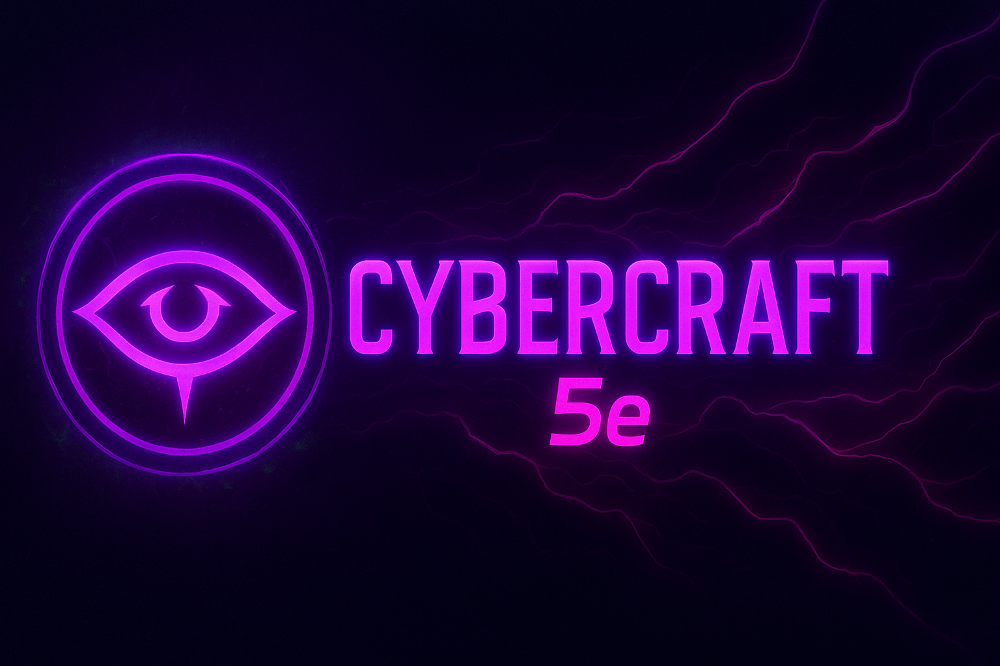

  

# Cybercraft 5e

Welcome to **Cybercraft 5e**, a cyberpunk-eldritch setting for the 5e rules system.

Here you'll find everything you need to create characters, run games, and explore the neon-lit, shadow-infested streets of **Echolight City**.

## Quick Links
- [Player Options](player-options/races.md)
- [Rules](rules/core-rules.md)
- [Game Master Tools](game-master/setting-overview.md)
- [Gear & Items](player-options/gear-items.md)

---

> **Disclaimer:** Cybercraft 5e is an independent 5e-compatible setting. It is not affiliated with or endorsed by Wizards of the Coast.  
> Portions of the material used here are derived from the 5e System Reference Document 5.1 and are licensed under the [Creative Commons Attribution 4.0 International License](https://creativecommons.org/licenses/by/4.0/).  
> All setting, character, and original content for Cybercraft is © [Your Name/Studio].
